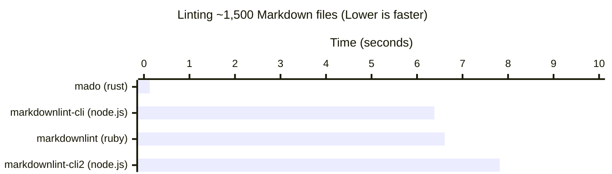

# Mado

[](https://github.com/akiomik/mado/actions/workflows/ci.yml)
[](https://codecov.io/github/akiomik/mado)

A fast Markdown linter written in Rust.
Compatible with [CommonMark](https://commonmark.org)
and [GitHub Flavored Markdown (GFM)](https://github.github.com/gfm/).

## Usage

```bash
mado check .
mado check path/to/*.md
```

## Performance

Approx. **49-60x faster** than existing linters
(e.g. [markdownlint](https://github.com/markdownlint/markdownlint)).



This benchmark was conducted on a MacBook Pro (2021, M1 Max)
using [hyperfine](https://github.com/sharkdp/hyperfine)
with [GitLab documentation](https://gitlab.com/gitlab-org/gitlab/-/tree/7d6a4025a0346f1f50d2825c85742e5a27b39a8b/doc)
as the dataset.

## Installation

### Homebrew (macOS and Linux)

```bash
brew tap akiomik/mado https://github.com/akiomik/mado.git
brew install mado
```

### Nix (macOS and Linux)

```bash
nix profile install github:akiomik/mado
```

### Arch Linux (Linux)

```bash
pacman -S mado
```

### Scoop (Windows)

```bash
scoop install https://raw.githubusercontent.com/akiomik/mado/refs/heads/main/pkg/scoop/mado.json
```

### WinGet (Windows)

```bash
# For security reasons, installing from local manifest files requires that this feature be enabled by an administrator.
# For more details, see https://learn.microsoft.com/en-us/windows/package-manager/winget/install#local-install
winget settings --enable LocalManifestFiles

curl.exe -o mado.yml https://raw.githubusercontent.com/akiomik/mado/refs/heads/main/pkg/winget/mado.yml
winget install -m mado.yml
```

### Manually

Pre-built binaries are available for download from [the release page](https://github.com/akiomik/mado/releases/latest).

## Supported Rules

Mado supports most [markdownlint rules](https://github.com/markdownlint/markdownlint/blob/main/docs/RULES.md).

* :white_check_mark: Stable support
* :hammer: Unstable support
* :warning: Unsupported option(s)
* :x: Not supported

| Rule  | Support            | Note                                           |
|-------|--------------------|------------------------------------------------|
| MD001 | :white_check_mark: |                                                |
| MD002 | :white_check_mark: |                                                |
| MD003 | :hammer:           |                                                |
| MD004 | :white_check_mark: |                                                |
| MD005 | :white_check_mark: |                                                |
| MD006 | :white_check_mark: |                                                |
| MD007 | :hammer:           |                                                |
| MD009 | :white_check_mark: |                                                |
| MD010 | :white_check_mark: |                                                |
| MD012 | :white_check_mark: |                                                |
| MD013 | :white_check_mark: |                                                |
| MD014 | :white_check_mark: |                                                |
| MD018 | :white_check_mark: |                                                |
| MD019 | :white_check_mark: |                                                |
| MD020 | :hammer:           |                                                |
| MD021 | :white_check_mark: |                                                |
| MD022 | :white_check_mark: |                                                |
| MD023 | :white_check_mark: |                                                |
| MD024 | :white_check_mark: |                                                |
| MD025 | :white_check_mark: |                                                |
| MD026 | :white_check_mark: |                                                |
| MD027 | :hammer:           |                                                |
| MD028 | :white_check_mark: |                                                |
| MD029 | :white_check_mark: |                                                |
| MD030 | :white_check_mark: |                                                |
| MD031 | :white_check_mark: |                                                |
| MD032 | :hammer:           |                                                |
| MD033 | :white_check_mark: |                                                |
| MD034 | :white_check_mark: |                                                |
| MD035 | :white_check_mark: |                                                |
| MD036 | :white_check_mark: |                                                |
| MD037 | :white_check_mark: |                                                |
| MD038 | :white_check_mark: |                                                |
| MD039 | :white_check_mark: |                                                |
| MD040 | :white_check_mark: |                                                |
| MD041 | :white_check_mark: |                                                |
| MD046 | :white_check_mark: |                                                |
| MD047 | :white_check_mark: |                                                |

## Configuration

Mado can be configured via `mado.toml` or `.mado.toml` file in the current directory.
You can also use global configuration files located in:

* `Linux`: `~/.config/mado/mado.toml`
* `macOS`: `~/.config/mado/mado.toml`
* `Windows`: `~\AppData\Roaming\mado\mado.toml`

For more details,
see [the example `mado.toml`](https://github.com/akiomik/mado/blob/main/mado.toml)
and [the JSON Schema for `mado.toml`](https://github.com/akiomik/mado/blob/main/pkg/json-schema/mado.json).

## GitHub Actions

Mado is compatible with GitHub Actions.

```yaml
# Basic usage (runs `mado check .`)
- uses: akiomik/mado@v0.3.0

# Custom usage (runs `mado` with specified arguments)
- uses: akiomik/mado@v0.3.0
  with:
    args: '--config path/to/mado.toml check path/to/*.md'
```

## Development

[just](https://github.com/casey/just/tree/master) is required.

### Running Tests

```bash
just test
```

### Linting Code

```bash
just lint
```

### Benchmarking

```bash
# Download Markdown dataset
./scripts/benchmarks/setup.sh

# Benchmark mado, mdl and markdownlint-cli using hyperfine
./scripts/benchmarks/comparison.sh
```

### Profiling

First, install [`flamegraph`](https://github.com/flamegraph-rs/flamegraph):

```bash
cargo install flamegraph
```

Then run:

```bash
just flamegraph
```

### Fuzz Testing

First, install [`cargo-fuzz`](https://github.com/rust-fuzz/cargo-fuzz):

```bash
cargo install cargo-fuzz
```

Then run:

```bash
just fuzz
```


> [!CAUTION]
> **This is for archival purposes only. Please do not use or modify this content.**

<br>

<p align="center">
<a href="https://discord.com/invite/8NJWstnUHd">

</a>
</p>
